# 🖐 소개(Introduction)

Wetube는 node.js 프레임 워크와 ES6 바닐라 자바스크립트를 이용해서 만든 유튜브 클론 웹 사이트 입니다. 백엔드 스택은 Node.js를 이용하였고, 프론트앤드 스택은 SCSS, 바닐라 자바스크립트를 이용하였습니다.
 
 
구현한 기능은 다음과 같습니다.

- 회원가입/로그인/구글 로그인/깃허브 로그인/로그아웃
- 비디오 업로드/수정/삭제
- 비디오 좋아요/싫어요
- 비디오 재생/볼륨 조절/진행 바 조절/다음 비디오/관련 비디오
- 댓글 작성/수정/삭제
- 유저 팔로우/언팔로우/프로필 사진 업로드 및 수정/이름 수정/ 비밀번호 변경
- 반응형 디자인
   
   
  본 프로젝트는 노마드 코더의 Youtube 클론 사이트 만들기라는 강의를 참조하였습니다.  

그렇다고 해서 완전히 강의와 똑같이 만들지는 않았습니다. 강의와의 차별성과 저 자신의 실력 향상을 위해 따로 추가적인 기능을 구현했습니다.
구현한 기능은 다음과 같습니다.  

- 다음비디오/관련비디오
- 댓글 수정/삭제
- 유저 팔로우/언팔로우/프로필 사진 삭제
- 반응형 디자인
    

프로젝트를 진행하면서, 성취감이 가장 높았던 점을 꼽으라면 비디오 페이지 오른쪽 사이드에 다음 비디오 및 관련비디오 뷰를 구현했을 때 입니다. 여기서 관련 비디오는 다음 비디오와 비디오 게시자가 팔로우한 유저가 올린 비디오로 구성된 것을 말합니다.  
저는 관련 비디오를 랜덤정렬해서 비디오 페이지에 디스플레이하고 싶었습니다. 그래서 [피셔예이츠 셔플 알고리즘(티 스토리에 정리)](https://taesung1993.tistory.com/54?category=872368)을 이용하여 원하는 기능을 구현할 수 있었습니다.

# 🚘 링크(To Link)

- Link -> [WETUBE](https://secret-savannah-99819.herokuapp.com/)
- 공유 아이디(shared Id): wetubeAdmin@gmail.com
- 공유 비밀번호(shared Password): 123
   
   

# 🔨 스킬(Skills)

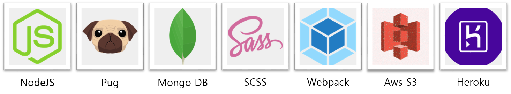
 
 

# 📢 기능(Characteristic)

### 1. 반응형 웹 사이트

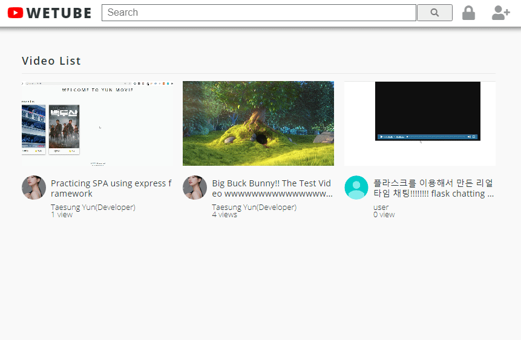

 
 

### 2. 로그인

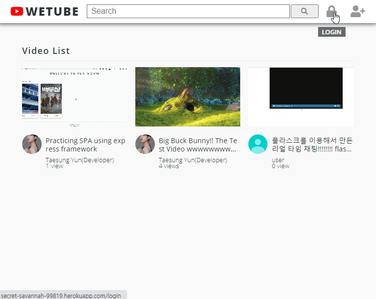

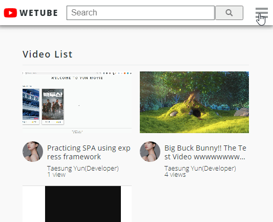

 
 

### 3. 비디오 페이지

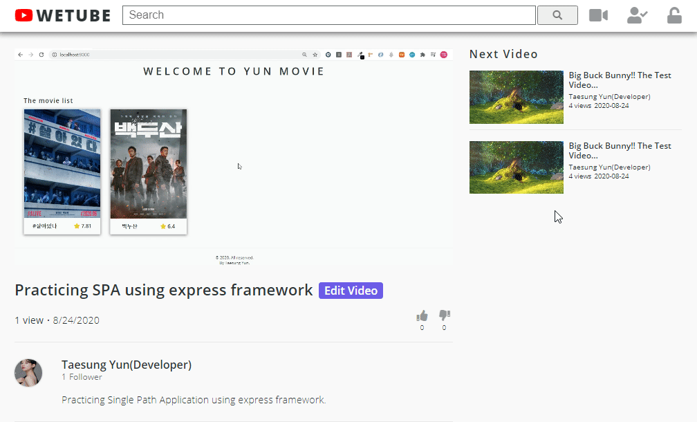

 
 

### 4. 동영상 재생

 
 

### 5. 관련 비디오

관련 비디오는 다음 비디오 + 게시자가 팔로우한 유저의 비디오로 이루어져 있습니다.

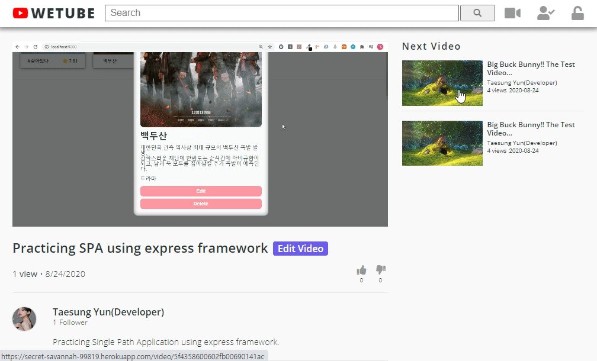

 
 

### 6. 댓글

- 댓글 쓰기

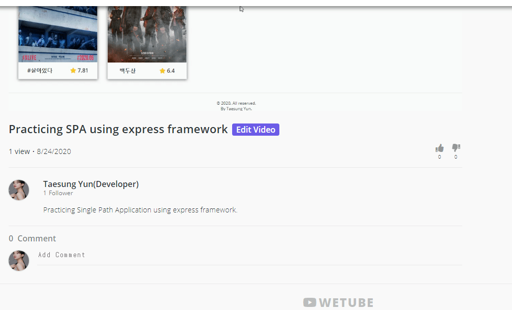

 
 

- 댓글 수정

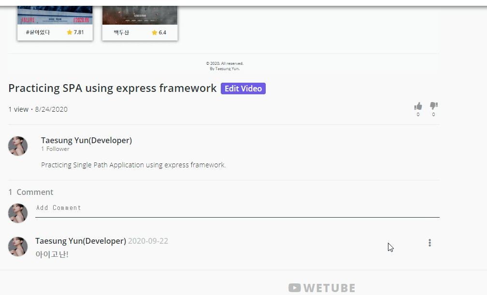

 
 

- 댓글 삭제

 
 

### 7. 좋아요 및 유저 팔로우

- 영상 좋아요

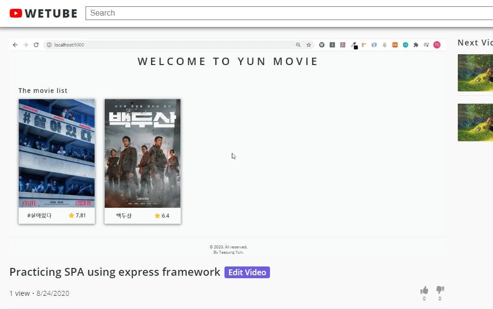

 
 

- 유저 팔로우

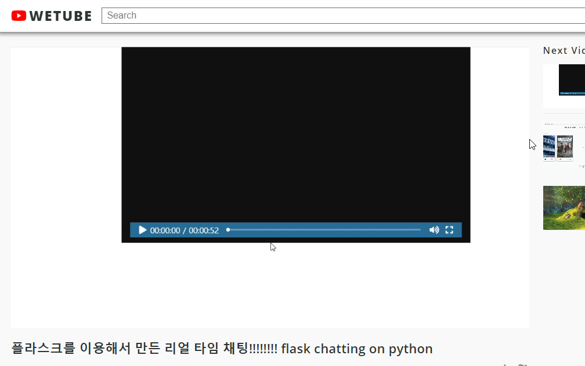

 
 

### 8. 비디오

- 업로드

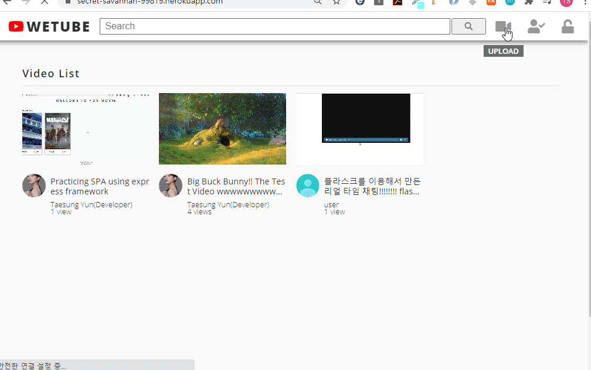

 
 

- 수정

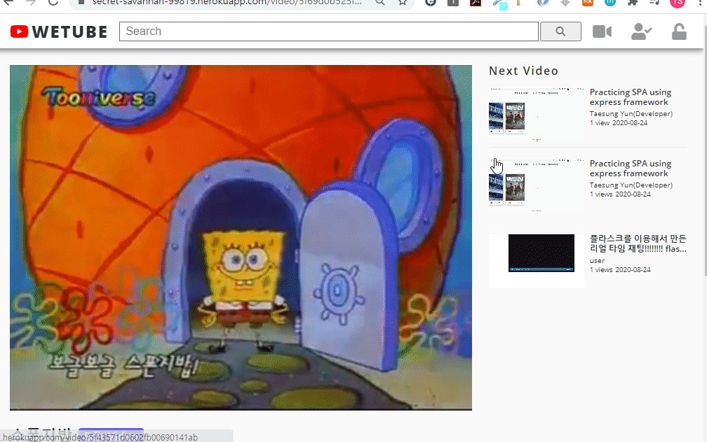

 
 

- 삭제

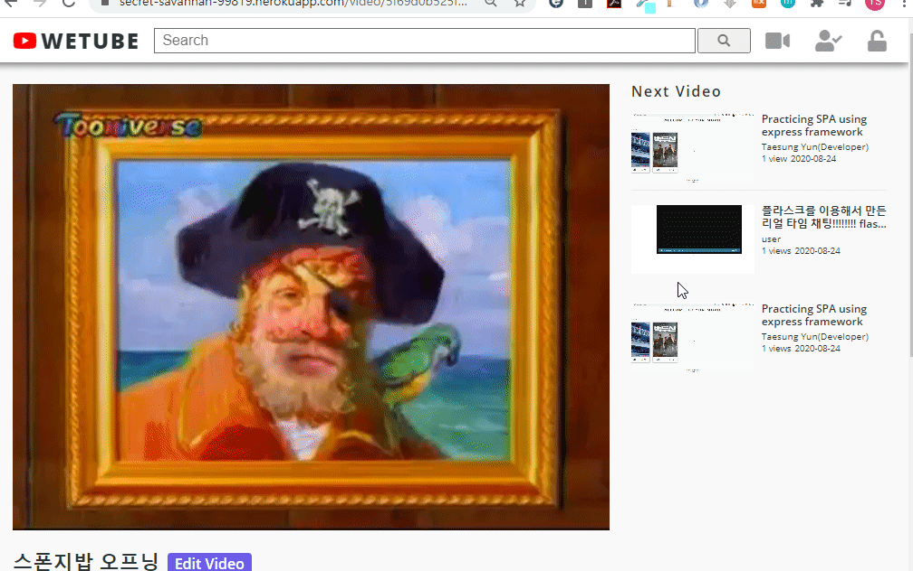

 
 

### 9. 프로필

- 프로필 사진 삭제

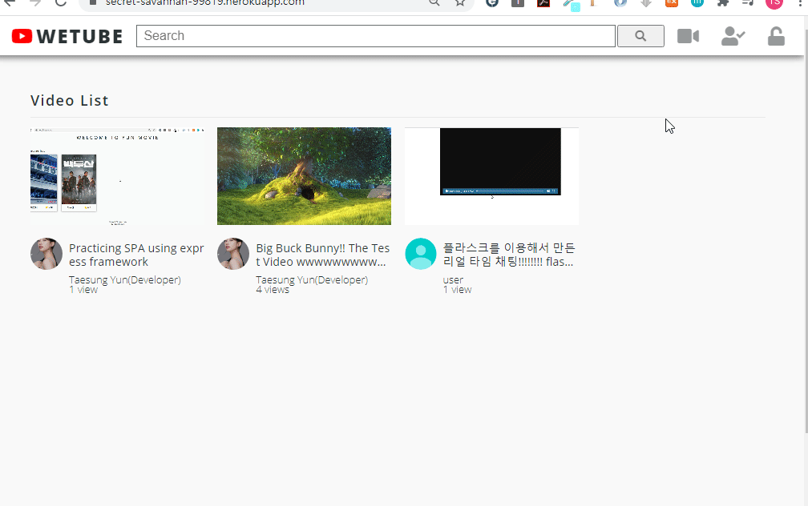

 
 

- 프로필 사진 등록 및 이름 바꾸기

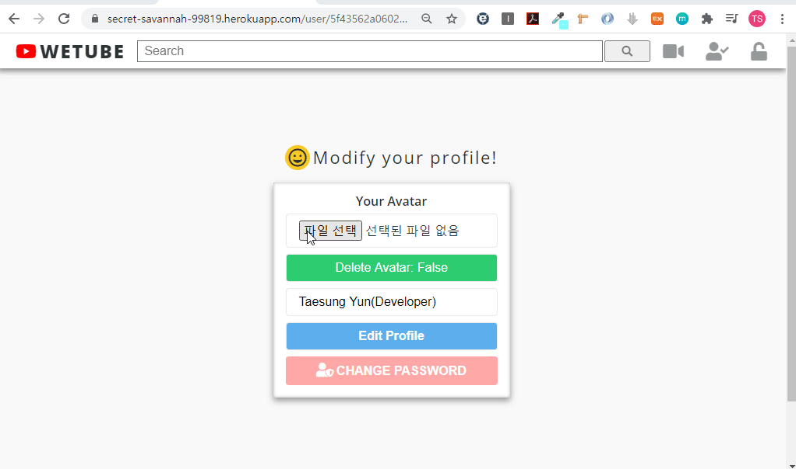

 
 
